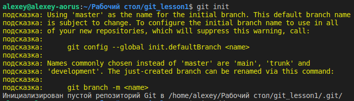

# Git &mdash; инструмент управления версиями&nbsp;

*Историческая справка:*

* 7 апреля 2005 г. &mdash; появление первой версии Git

* 16 апреля 2005 г. &mdash; первая фиксация ядра Linux Линусом Торвальдсом с использованием Git

-------------

## Установка

В системах Linux, основанных на дистрибутиве Debian, для установки базового пакета Git выполнить команду:

    $ sudo apt-get install git

Для установки в системах Windows &mdash; [скачать](https://git-scm.com/download/win, "git-scm.com/download/win")  подходящий установочный пакет.

Чтобы убедиться, что установка прошла успешно, в командной оболочке системы можно выполнить команду вывода версии установленного Git:

    git --version

## Основные команды

Ранние версии Git состояли из набора автономных исполняемых файлов, представляющих отдельные команды. Каждая команда начиналась со строки *git*, содержала дефис и название действия, например: `git-log`. Старые имена команд могут до сих пор использоваться в некоторых пакетах, например в *msysGit* для Windows.

В последних версиях Git основной набор команд выполняется единственной исполняемой программой git с указанием выполняемого действия в качестве *параметра* через пробел.

Команда `git` без аргументов выведет возможные параметры и список общих команд. Чтобы вывести полный список команд, введите `git help --all`. А чтобы получить справку по конкретной команде, введите `git help <имя_команды>`:

    $ git
    $ git help --all
    $ git help commit

### Создание начального репозитория

Чтобы превратить локальный каталог, который ещё не находится под версионным контролем, в репозиторий Git, необходимо в командной оболочке перейти в данный каталог, т.&nbsp;е. сделать его рабочим (текущим) и выполнить команду `git init`:

    $ git init

*Пример выполнения команды:*

В рабочем каталоге создаётся скрытый каталог .git.

### Настройка автора фиксаций

Для фиксации (коммита) обязательно указание автора фиксакции: имя и e-mail.

Указание данных автора непосредственно в команде фиксации:

    $ git commit -m "Первый коммит" \
        --author="Alexey Kuznetsov <alexeykuznetsov@rocketmail.com>"

Для сохранение данных автора в файле конфигурации конкретного репозитория используется команда `git config`:

    $ git config user.name "Alexey Kuznetsov"
    $ git config user.email alexeykuznetsov@rocketmail.com

Для указания данных автора, специфичных не для конкретного репозитория, а для пользователя системы, необходимо использовать команду `git config` с опцией `--global`:

    $ git config --global user.name "Alexey Kuznetsov"
    $ git config --global user.email alexeykuznetsov@rocketmail.com

Настройки, специфичные для репозитория, имеют больший приоритет над настройками, установленными для пользователя системы, и переопределяют их.

### Проверка текущего состояния репозитария

Команда `git status` покажет, есть ли незафиксированные изменения в репозитарии, отобразит промежуточные состояния отслеживаемых файлов и наличие неотслеживаемых, сообщит, какие действия будут произведены при следующей фиксации в репозитарий:

    $ git status

*Пример выполнения команды:*

### Включение файлов в репозиторий/фиксацию

Чтобы добавить неотслеживаемый файл в индекс репозитория, а также чтобы включить изменения файла в следующую фиксацию, используется команда `git add`:

    $ git add <файл>

Чтобы добавить в репозиторий и/или включить в коммит все файлы в каталоге и во всех подкаталогах, в команде вместо имени файла указывается точка:

    $ git add .

### Фиксация изменений (коммит)

Команда `git commit` берёт все данные, добавленные в индекс с помощью `git add`, и сохраняет их слепок во внутренней базе данных, а затем сдвигает указатель текущей ветки на этот слепок. Описание фиксации возможно добавить в команду с помощью параметра `-m`:

    $ git add .
    $ git commit -m "Первая фиксация"

Используя параметр `-a` можно включить сразу все изменения во всех ___отслеживаемых___ файлах в фиксацию без необходимости прибегать к `git add`:

    $ git commit -am "Фиксация всех изменений"

*Внимание:* Данный способ не влечёт добавление и фиксацию ещё неотслеживаемых файлов. Новые файлы требуется добавлять в индекс репозитория, используя команду `git add`!

### Просмотр фиксаций

Каждой фиксации Git присваивает уникальный 40-разрядный шестнадцатеричный идентификатор. Для получения информации по конкретной фиксации, при указании её идентификатора в команде, достаточно использовать как минимум первые 4 знака идентификатора.

Для просмотра отдельной истории фиксаций в репозитории используется команда `git log`. Записи выводятся в порядке от самой последней до самой старой:

    $ git log

Для просмотра списка записей изменений в головы веток используется команда `git reflog`:

    $ git reflog

*Пример выполнения команды:*

Для получения более подробной информации о конкретной фиксации используется команда `git show` с указанием идентификатора. Без указания идентификатора фиксации команда выведет информацию о последней фиксации:

    $ git show

*Пример &mdash; информация о фиксации d4f81de:*

### Переключение между версиями

Команда `git checkout` позволяет переключится к состоянию репозитория, соответствующего определённому коммиту или переключиться на другую ветку:

    $ git checkout <идентификатор_коммита>

Такое переключение будет невозможно если есть незаконченная фиксация.

Для возврата к текущему рабочему коммиту текущей ветки следует указать имя ветки, например `master`, в качестве параметра команды:

    $ git checkout master

### Просмотр разницы между фиксациями

Команда `git diff` с указанием идентификаторов двух фиксаций позволяет увидеть разницу между этими двумя версиями:

    $ git giff <ранняя_версия> <новая_версия>

Использование команды без указания идентификаторов выведет разницу для последней фиксации.

## Управление индексацией

### Пустые дирректории

Git не включает пустые дирректории в индекс. Однако, возможны ситуации, когда в репозитории должна быть какая-то дирректория, но в ней ещё нет файлов. Для целей сохранения пустых дирректорий в репозиторий следует добавлять в такие дирректории пустой файл, имеющий специальное имя `.gitkeep`.

### Игнорирование файлов и дирректорий

Git предоставляет механизм для явного игнорирования файлов и каталогов. Игнорируемые файлы &mdash; это файлы, для которых нет необходимости в управлениями версиями, или файлы, которые по какой-либо иной причине не должны попадать в фиксации (большие бинарные файлы, временные и служебные файлы, генерируемые компиляторами, логи и т.&nbsp;п.)

Для данных целей в корневом каталоге репозитория регистрируется специальный файл `.gitignore` в котором указываются файлы и дерриктории, которые требуется игнорировать. Для сопоставления с именами файлов в *.gitignore* используются *шаблоны подстановки*.

Допускается определение нескольких файлов *.gitignore* в разных каталогах репозитория. Каждый шаблон из конкретного файла *.gitignore* проверяется относительно каталога, в котором он расположен. Однако рекомендуемым подходом является использование одного файла *.gitignore* в корневом каталоге репозитория.

## Работа с ветками

***Ветка*** &mdash; отдельная линия разработки в проекте. Ветки позволяют легко управлять чистовиками и чистовиками, работать разным разработчикам над одними и теми же файлами, а также вести одновременную разработку в нескольких направлениях.

### Просмотр

Чтобы получить список всех веток репозитория с указанием текущей рабочей ветки используется команда `git branch` без указания параметров:

    $ git branch

Вывести граф фиксаций с визуальным отображением веток:

    $ git log --graph

Чтобы получить аналогичный граф фиксаций в лаконичной компактной форме следует добавить параметры `--abbrev-commit` и `--pretty=oneline`:

    $ git log --graph --abbrev-commit --pretty=oneline

### Создание, удаление и навигация

Для создания новой ветки в команде `git branch` в качестве параметров последовательно указываются имя новой ветки и имя уже сущетсвующей ветки, которая должна стать родительской по отношению к создаваемой (дочерней):

    $ git branch <имя_новой_ветки> <имя_ветки-родителя>

В случае если опустить второй параметр, создаваемая ветка станет дочерней по отношению к текущей рабочей ветке:

    $ git branch <имя_новой_ветки>

Данные команды не выполняют переключение на созданную ветку. После создания новой ветки, рабочая ветка всё-ещё остаётся прежней. Чтобы начать работать во вновь созданой ветке необходимо сперва переключиться на неё.

Для переключения между ветками служит команда `git checkout`:

    $ git checkout <имя_ветки>

Команда `git checkout` с ключом `-b` позволяет созать новую ветку, если ветки с указанным именем ещё не существует, и одновременно сразу переключиться на неё:

    $ git checkout -b <имя_новой_ветки>

Сразу после создания новой ветки и переключения на неё, указатель HEAD смотрит на обе ветки, новую и родительскую, поскольку текущий коммит родительской ветки становится одновременно и вершиной будущей серии коммитов новой ветки.

Для "безопасного" удаления указанной ветки используется команда `git branch` с опцией `-d`. Git не позволит удалить ветку при наличии в ней неслитых изменений:

    $ git branch -d <имя_ветки>

Принудительное удаление ветки, даже при наличии неслитых изменений:

    $ git branch -D <имя_ветки>

или

    $ git branch --delete --force <имя_ветки>

Чтобы изменить имя текущей ветки, используется опция `-m`:

    $ git branch -m <новое_имя>

## Слияние

***Слияние*** позволяет собрать отдельные направления разработки воедино, т.&nbsp;е. в единую ветку.

Для выполнения слияния используется команда `git merge`, объединяющая несколько последовательностей коммитов в общую историю.

Чаще всего выполняют слияние двух веток. Чтобы подготовится к слиянию необходимо предпринять ряд шагов:

1. Определиться с выбором принимающей ветки и при необходимости переключится на неё с помощью команды `git checkout`.

2. В случае работы с удалённым репозиторием &mdash; убедиться, что принимающая ветка и ветка для слияния содержат последние изменения из удалённого репозитория: выполнить команду `git fetch`, чтобы получить из него последние коммиты.

3. Также убедиться, что основная ветка (обычно main или master) содржит последние изщменения: выполнить команду `git pull`.

4. Можно приступать к слиянию:

    `$ git merge <имя_ветки>`
    
    здесь `<имя_ветки>` &mdash; название ветки, которая будет объединена с принимающей.

В результате слияния двух веток создаётся коммит слияния, который отличается от прочих наличием двух родительских элементов.

Создавая коммит слияния, Git попытается автоматически объединить две истории. Однако если Git обнаружит, что вы изменили одну и ту же часть данных в обеих историях, сделать это автоматически не удастся. Это называется *конфликтом управления версиями*, и для его разрешения Git потребуются действия пользователя.

## Работа с удалёнными репозиториями

### Управление подключениями

Для упрвления конфигурациями подключений в Git служит команда `git remote`.
Выполнение команды без параметров выведет список удалённых подключений к другим реаозиториям:

    $ git remote

Команда с параметром `-v` выведет список подключений с указанием URL-адресов:

    $ git remote -v

Для получения подробного вывода о конфигурации удалённого репозитория к команде `git remote` следует добавить подкоманду `show`:

    $ git remote show <имя_подключения>

Команда `git remote` предоставляет удобные способы изменения конфигурационного файла репозитория `/.git/config`:

Создание нового именованного подключения к удалённому репозиторию:

    $ git remote add <имя_подключения> <url-адрес>

Удаление подключения:

    $ git remote rm <имя_подключения>

Переименование подключения:

    $ git remote rename <текущее_имя_подключения> <новое_имя_подключения>

*На заметку!:* В процессе клонирования удалённого репозитория с помощью команды `git clone` автоматически создаётся удалённое подключение к исходному репозиторию с именем `origin`.

### Отправка данных в удалённые репозитории

Для выгрузки содержимого локального репозитория в удаленный репозиторий используется команда `git push`:

    $ git push <имя_подключения> <имя_ветки_для_отправки>

Для создания связи между ветками локального и удалённого репозиторитев, при первой выгрузке новой локальной ветки следует использовать данную команду с параметром `-u` (полная версия `--set-upstream`):

    $ git push -u <имя_подключения> <имя_ветки_для_отправки>

Если выполнить git push ветки без ключа `-u`, то Git не свяжет локальную ветку с веткой удалённого репозитория. Последующая операция git pull в этой ветке будет неудачной, так как Git не будет знать, из какой удалённой ветки подтягивать изменения. Это придётся указать явно при помощи команды

    $ git branch --set-upstream-to=<подключение>/<ветка>.

Смысл использовать ключ `-u` есть только при пуше новых веток, для существующих (связанных с удалёнными) веток каждый раз перезаписывать связку необязательно.

Итак, команда `git push` с указанием ветки создаёт локальную ветку в репозитории назначения вместе со всеми необходимыми коммитами и внутренними объектами. Чтобы предотвратить перезапись коммитов, Git позволит опубликовать данные только в том случае, если в репозитории назначения можно выполнить *ускоренное слияние*.

***Ускоренное слияние*** происходит, когда последний коммит текущей ветки является прямым продолжением целевой ветки (т.&nbsp;е. например, когда в чистовой родительской ветке не было фиксаций с момента образования черновой ветки). В этом случае для объединения истории Git не выполняет полноценное слияние, а просто переносит указатель текущей ветки в конец целевой ветки.

Команда `git push` может перезаписать изменения, поэтому её следует использовать с особым вниманием и осторожностью.

Так, для принудительной публикации данных, даже если нельзя выполнить ускоренное слияние, с командой используется флаг `--force`:

    $ git push <имя_подключения> --force

Публикация всех локальных веток:

    $ git push <имя_подключения> --all

Теги не публикуюся автоматически. Для отправки всех локальных тегов в удалённый репозиторий необходимо использовать флаг `--tags`:

    $ git push <имя_подключения> --tags

### Загрузка данных из удалённых репозиториев

Для извлечения, загрузки содержимого из удаленного репозитория и немедленного обновления локального репозитория этим содержимым, используется команда `git pull`:

    $ git pull <имя_подключения>

Команда `git pull` на самом деле представляет собой комбинацию двух других команд: `git fetch` и `git merge`:

    $ git fetch <имя_подключения>
    $ git merge <имя_подключения>/<имя_текущей_ветки>

В результате загрузки содержимого и последующего слияния, для слитого содержимого создается новый коммит, а указатель `HEAD` обновляется и начинает указывать на этот новый коммит.

Извлечение удаленного содержимого без создания нового коммита со слитым содержимым:

    $ git pull --no-commit <имя_подключения>

Извлечение удаленного содержимого, но с применением перебазирования вместо слияния для интеграции удалённой ветки с локальной:

    $ git pull --rebase <имя_подключения>

Перебазирование можно использовать, чтобы сохранить линейную историю и избежать ненужных коммитов слияния.

Для подробного вывода о загружаемом содержимом иинформации о слиянии, используется флаг `--verbose`:

    $ git pull --verbose
